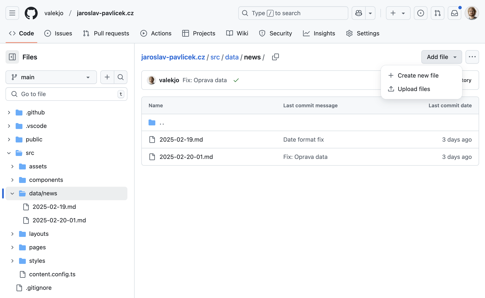

# Návod na editaci obsahu

Základní návod, můžeme postupně rozšiřovat.

## Přidávání aktualit

### 1. Vytvoření nového souboru

Ve složce [`src/data/news`](https://github.com/valekjo/jaroslav-pavlicek.cz/tree/main/src/data/news) kliknout vpravo nahoře na "Add file" a potom vybrat možnost "Create new file".



### 2. Vyplnění obsahu aktuality

Do kolonky nahoře uprostřed se vyplňuje název sobouru. Ten musí být unikátní v rámci složky, a musí končit příponou `.md`.

Aktuality i další obsah se zadávají ve formátu markdown, s hlavičkou na začátku.

Hlavička začíná a končí třemi pomlčkami `---` a musí obsahovat datum publikace ve formátu `date: YYYY-MM-DD` a titulek jako `title: "Titulek"`. Podle data publikace jsou pak aktuality seřazeny.

Za hlavičkou následuje samotný obsah, tam je možné používat základní formátování.

Je tedy možné začít třeba s tímto obsahem, a ten dále upravovat:

```
---
date: 2025-01-01
title: 'Seminář Trosečník v drsné přírodě'
---

Dne toho a toho, tam a tam.
```

Pro kurzívu stačí daný text začít a ukončit hvězdičkou, pro tučný text dvěma hvězdičkami. Např. `Tento text bude *kurzívou* a tento **tučně**.`

Mezi odstavci je třeba nechat jeden prázdný řádek.


Doplnime ještě informaci o tom, jak přidávat obrázky.

### 3. Publikace

Když je aktualita připravená, stačí klinout na zelené tlačítko vpravo nahoře "Commit changes...".

Pak vyskočí formulář, ten stačí potrvrdit zase zeleným tlačítkem "Commit changes". Údaje ve formuláři není třeba měnit, slouží primárně k evidenci změn.


### Hotovo

Zhruba do minuty se nová aktualita objeví na webu.

## Editace aktuality

V seznamu souborů stačí vybrat odpovídající aktuality a pak kliknout na ikonku tužky vpravo. Další postup už je stejný jako při přidávání aktuality.


