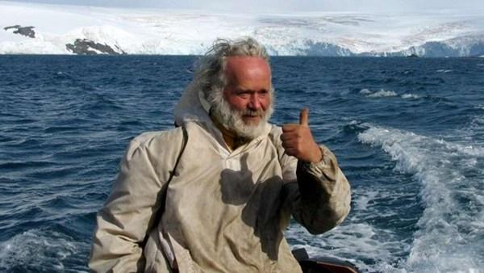

# Jaroslav Pavlíček

Jaroslav Pavlíček se celý svůj život zaměřuje na výzkum přežití v divočině a na soužití člověka s přírodou.

Je autorem příručky „Člověk v drsné přírodě“, které se prodalo už více než 100 000 výtisků.