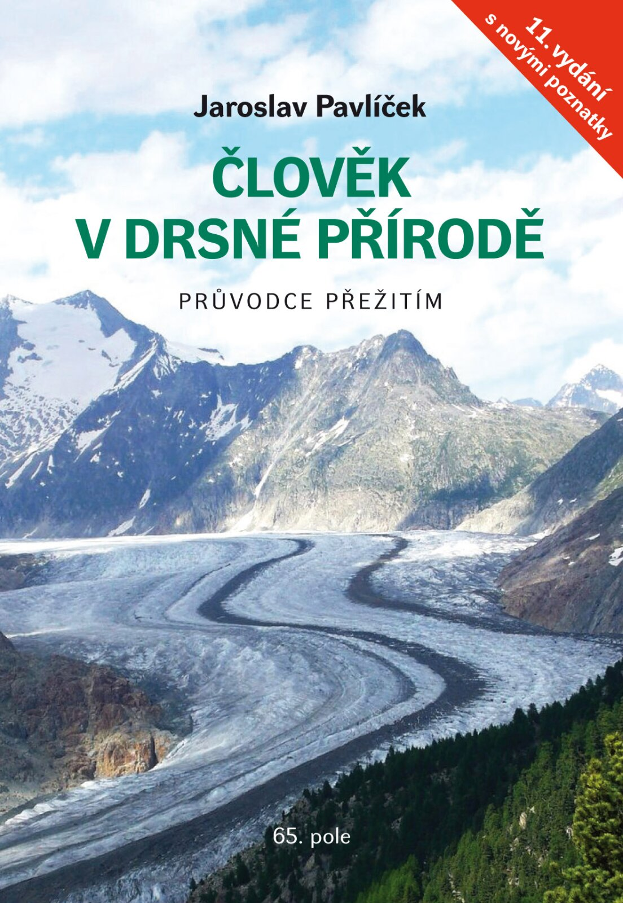

# Příručka Člověk v drsné přírodě

Člověk v drsné přírodě přináší zásadní informace, jejichž znalost může rozhodnout o&nbsp;přežití. Příručka byla přeložena do angličtiny, němčiny a čínštiny a zaznamenala přes sto tisíc prodaných výtisků. 11. vydání je doplněno nejnovějšími poznatky z posledních let.

Příručku je možné koupit v dobrých knihkupectvích a na webu [Nakladatelství 65. pole](https://www.65pole.cz/kniha/clovek-v-drsne-prirode/).

