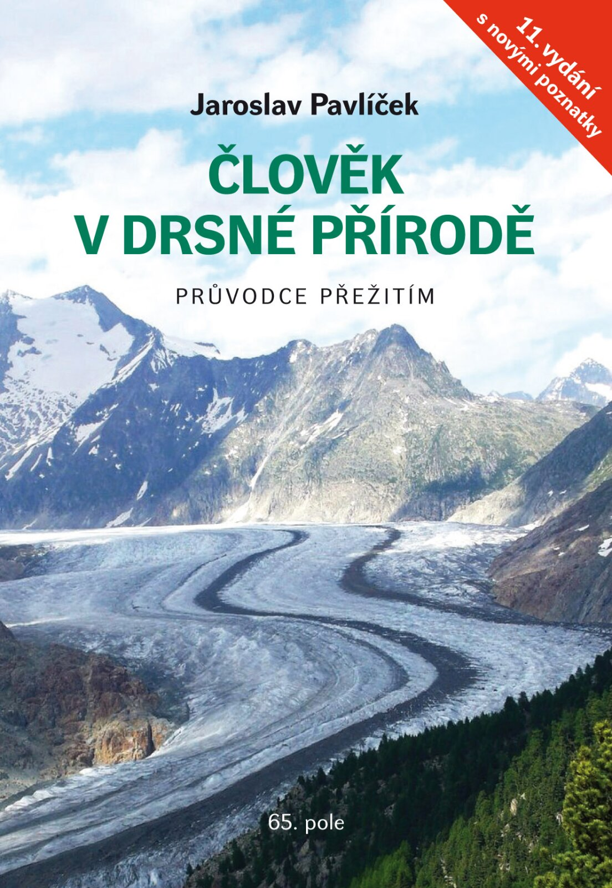

# Příručka Člověk v drsné přírodě

Člověk v drsné přírodě přináší zásadní informace, jejichž znalost může rozhodnout o&nbsp;přežití. Příručka byla přeložena do angličtiny, němčiny a čínštiny a zaznamenala přes sto tisíc prodaných výtisků. 11. vydání je doplněno nejnovějšími poznatky z posledních let.

Knihu vydalo [Nakladatelství 65. pole](https://www.65pole.cz).

    

